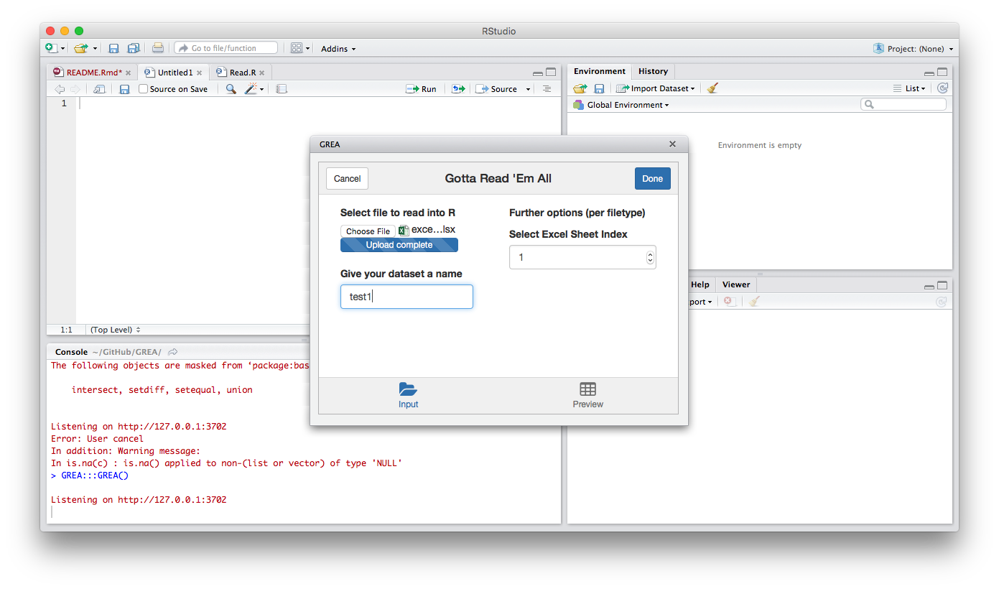
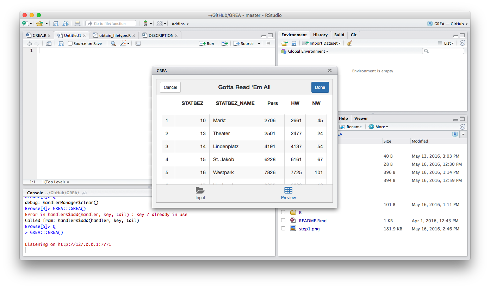

---
output:
  md_document:
    variant: markdown_github
---

<!-- README.md is generated from README.Rmd. Please edit that file -->

```{r setup, echo=FALSE}
knitr::opts_chunk$set(
  collapse = TRUE,
  comment = "#>",
  fig.path = "README-"
)
```


  		  
GREA (Gotta Read 'Em All)
==============
[](https://travis-ci.org/Stan125/GREA)

GREA (Gotta Read 'Em All) is an RStudio Add-In assisting to read all popular file formats into R through R base functions and [rio](https://cran.r-project.org/web/packages/rio/README.html). In the beginning, the user selects a file on his computer. After some optional adjustments (which are done interactively), the proper function to read the file is pasted into the console, with an object name that can be specified by the user. Supported file formats include Stata (.dta), SPSS (.sav), Matlab (.mat), Excel (.xls, .xlsx) and various text/delimited-formats (.raw, .csv, .txt, .asc, .dat, etc.).

Click [here](http://imgur.com/a/a9M1p) for an interactive comic on why GREA is important.

### News

16.05.2015
- First version of GREA was wrapped up into a package

22.05.2015
- `shiny::fileInput` dependency replaced with `fileChoose()` function

26.05.2015
- Big structural revamp: Add-In now pastes the proper function to parse the file right into the console!

18.06.2015
- Now relies heavily on [rio](https://cran.r-project.org/web/packages/rio/README.html), therefore supporting way more filetypes. 

### Installation

To install the Add-In, run the following code:
```{r installation, eval=FALSE}
devtools::install_github("Stan125/GREA")
```

### Usage

#### 0. Starting the Add-In
Calling the Add-In is simple: just click on the Add-In Tab and select 'Gotta Read Em All'. The Add-In itself quickly pops up and you are good to go!

#### 1. Selecting the dataset
Once the Add-In is started up, press the "Select File" button to select a file on your computer. Then, you can specify a name for your dataset (if blank, the filename, without extension, is used). Once the file is loaded into the Add-In, you may see additional options for parsing the file. Ignore those for now and head right to the "Preview" tab.



#### 2. Looking at the preview
The preview tab shows a preview of what your dataframe would look like if you parsed it with the current settings. If something looks odd (e.g. your column names fell into the first row of the dataset), head back to the first tab. If everything is right, still head back to the first tab.



#### 3. Adjusting stuff
If the preview of your dataframe looked off, you now have the chance to adjust some parameters (e.g. Sheet Index for Excel files, or separator for delimited files). Adjust them so your preview looks exactly like you want them to. When you are finished (and have typed in a name for your newly aquired dataset), press "done". Afterwards, the function to read your dataset is pasted into your console. Boom! You're good to go.

### Code of Conduct

Please note that this project is released with a [Contributor Code of Conduct](CONDUCT.md). 
By participating in this project you agree to abide by its terms.
